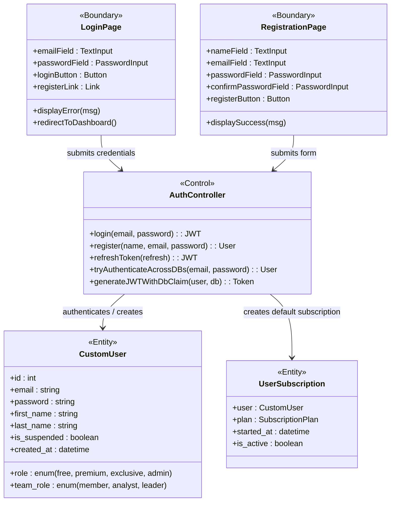
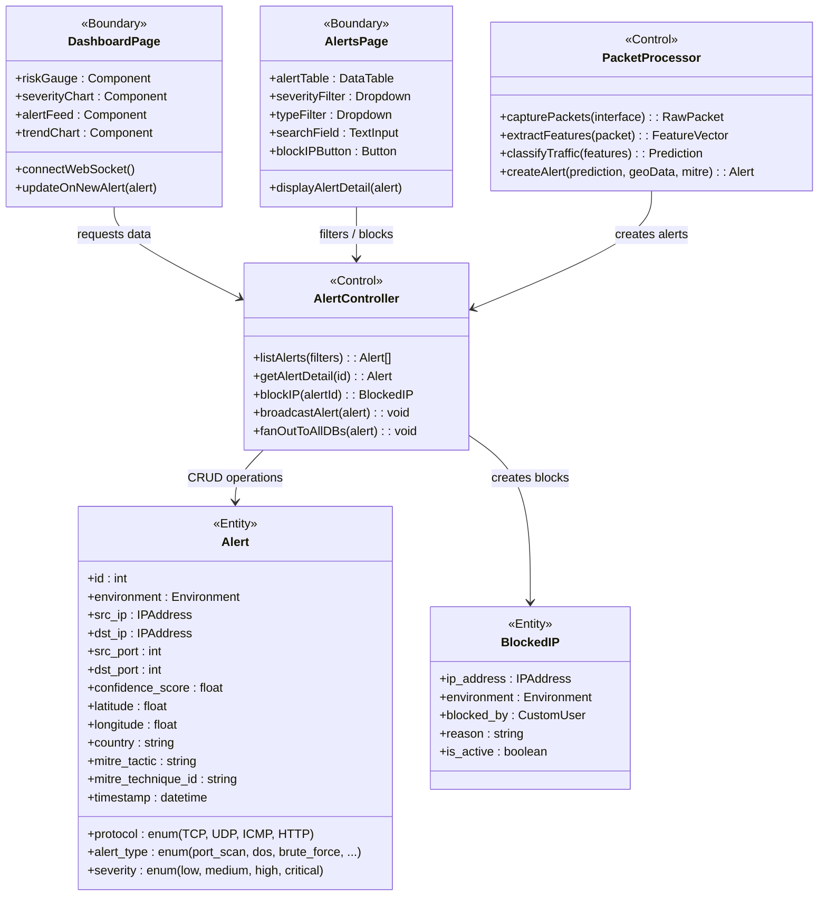
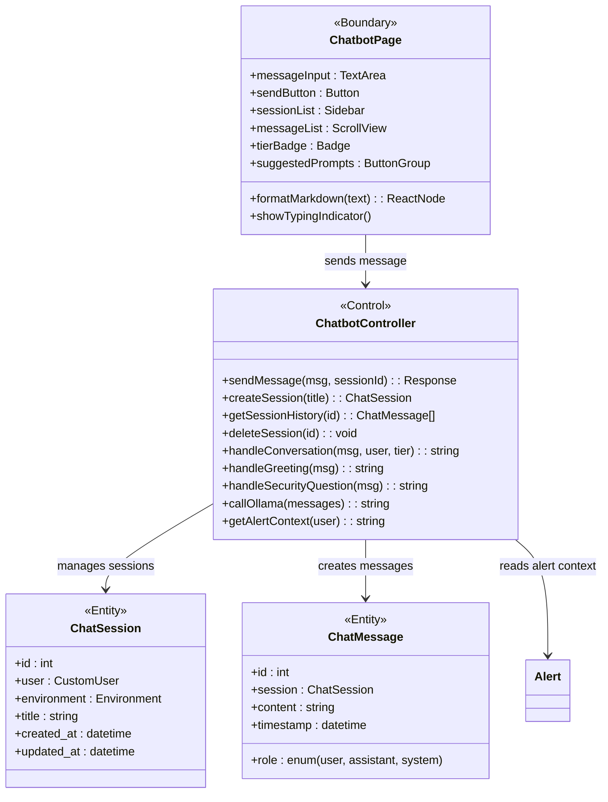
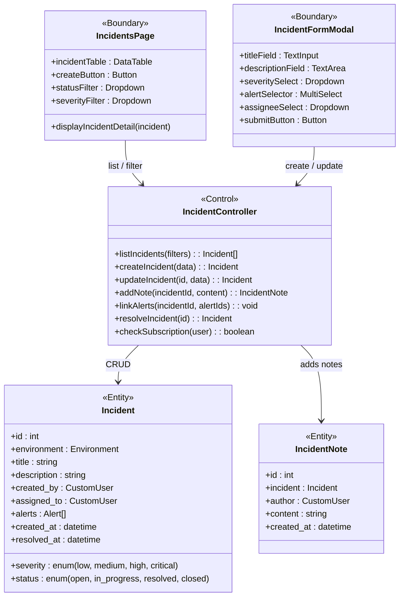
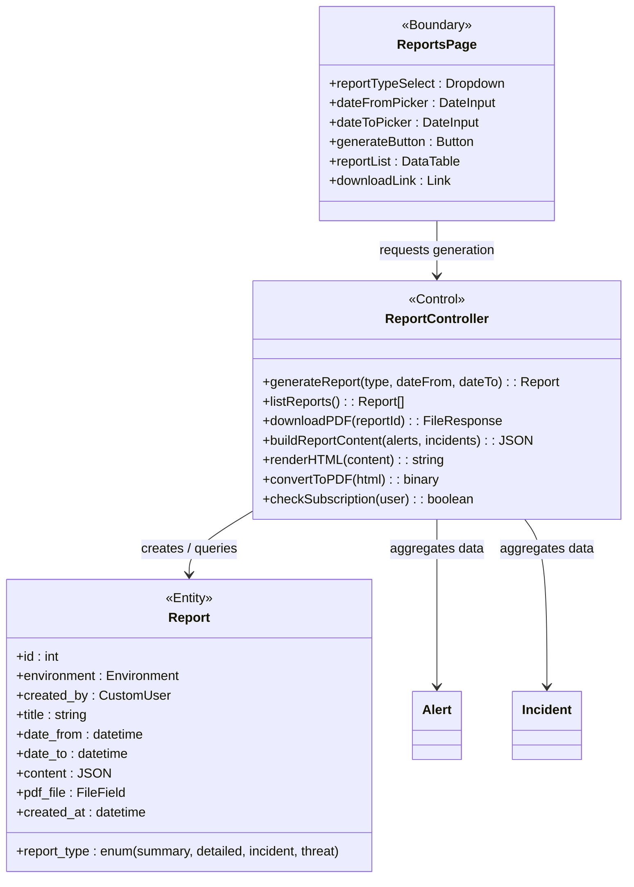
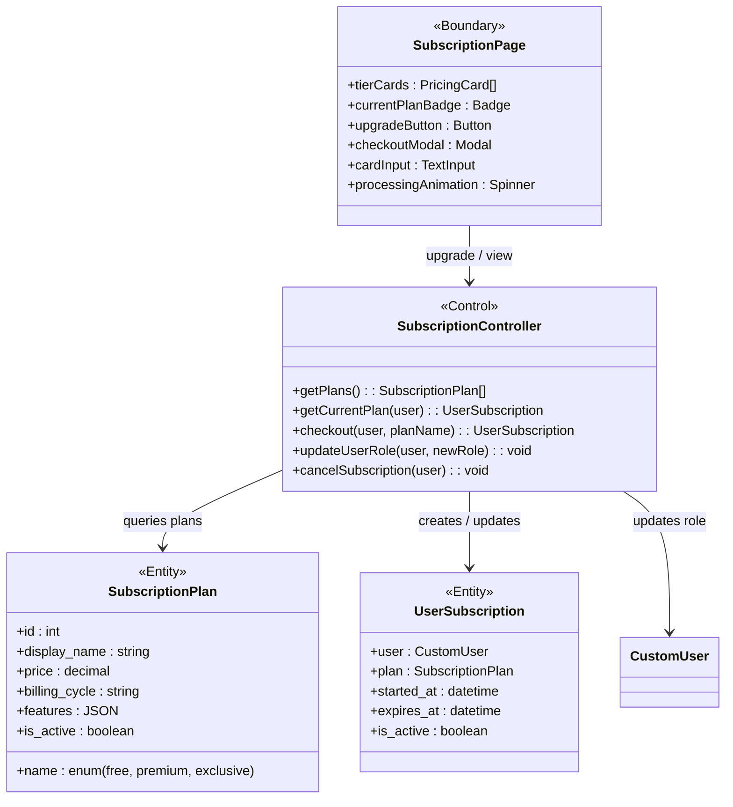
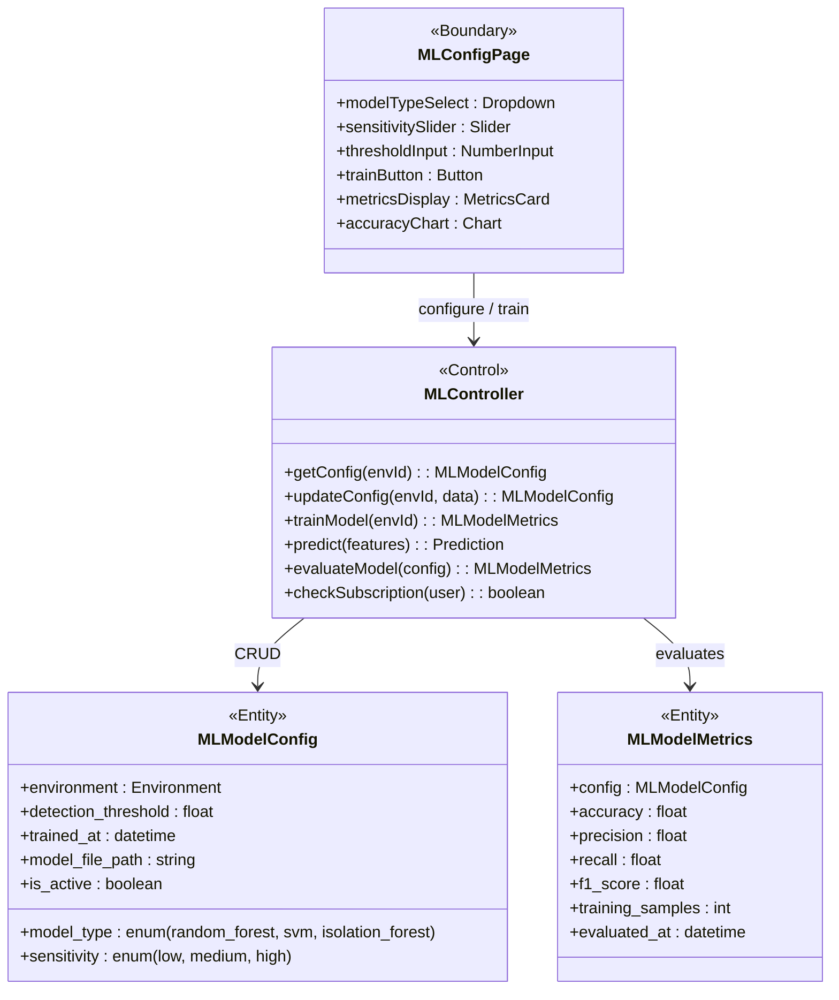
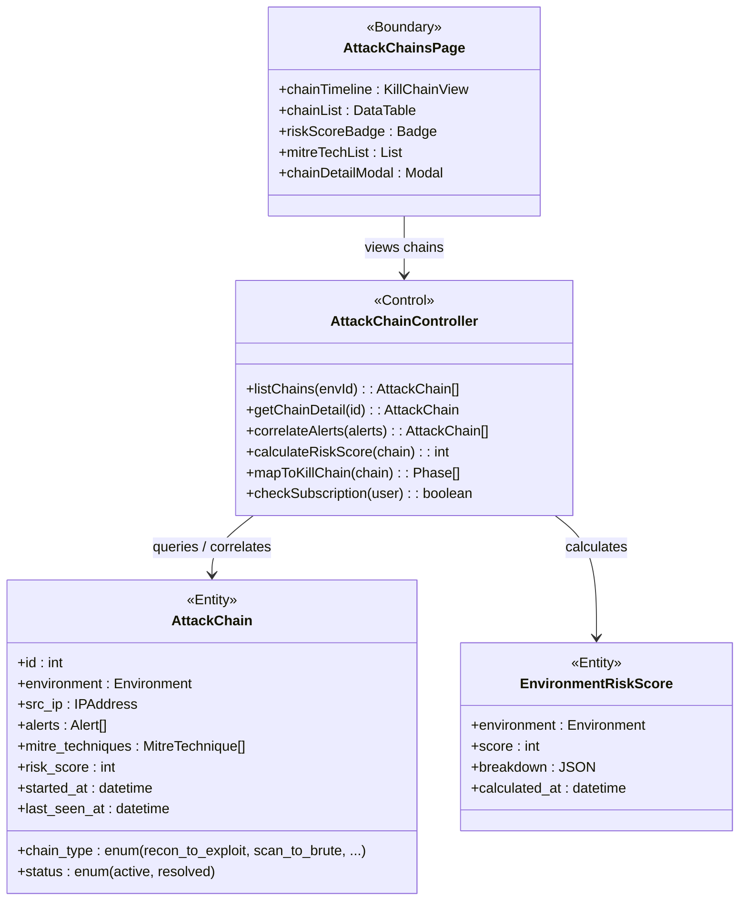
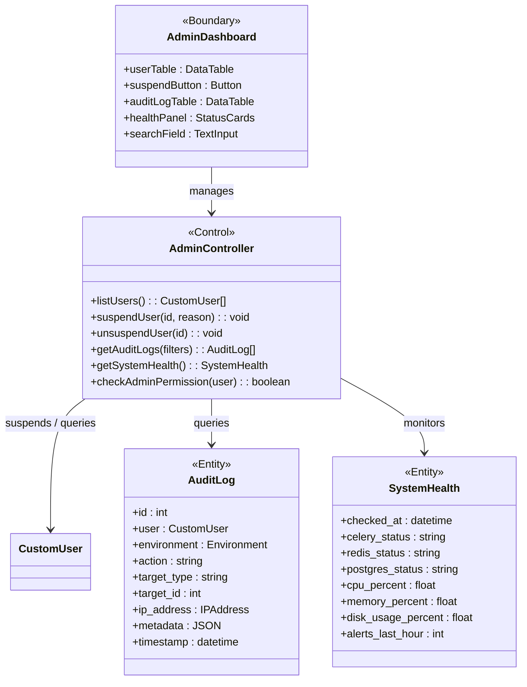

# DurianDetector IDS — BCE Class Diagrams (Boundary-Control-Entity)
## FYP-26-S1-08

> Paste any of these into [mermaid.live](https://mermaid.live) to render and export as PNG/SVG for your report.

---

## 1. User Authentication BCE

---

## 2. Alert Detection & Monitoring BCE

---

## 3. DurianBot Chatbot BCE

---

## 4. Incident Management BCE

---

## 5. Report Generation BCE

---

## 6. Subscription Management BCE

---

## 7. ML Engine Configuration BCE

---

## 8. Attack Chain Analysis BCE

---

## 9. Admin Panel BCE

