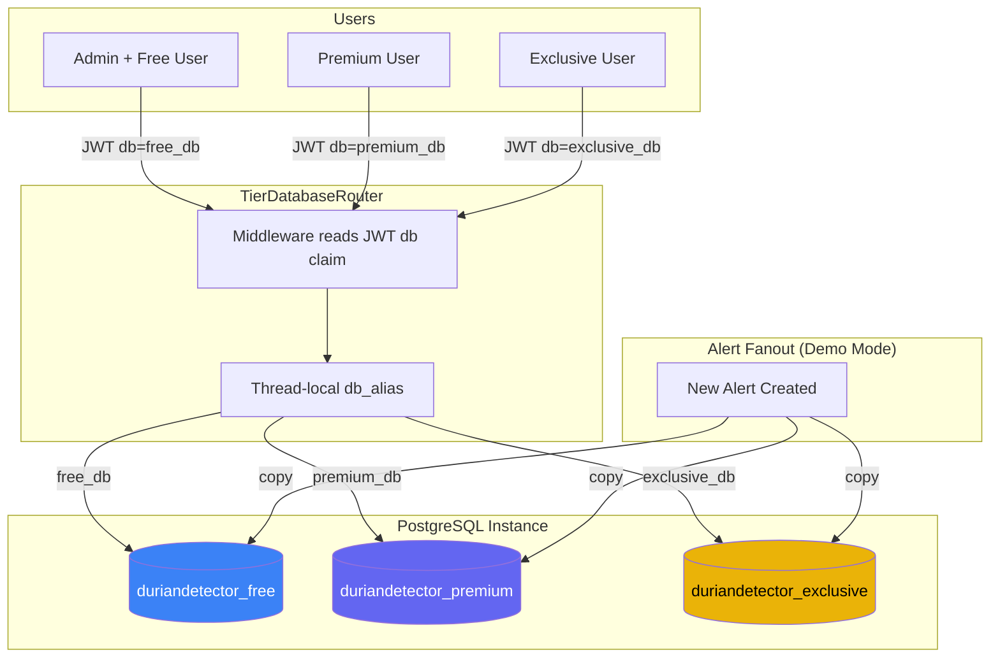

# DurianDetector IDS — Database Class Diagram (Entity Relationship)
## FYP-26-S1-08

> Paste into [mermaid.live](https://mermaid.live) to render and export as PNG/SVG for your report.

---

## Full Database Schema

```mermaid
classDiagram
    class CustomUser {
        +int id
        +string email [unique]
        +string password
        +string first_name
        +string last_name
        +string role [free|premium|exclusive|admin]
        +string team_role [member|analyst|leader]
        +boolean is_suspended
        +datetime suspended_at
        +string suspended_reason
        +string last_login_ip
        +datetime created_at
        +datetime updated_at
        +suspend(reason)
        +unsuspend()
    }

    class PasswordResetToken {
        +int id
        +UUID token [unique]
        +datetime expires_at
        +boolean used
        +datetime created_at
        +is_valid() boolean
    }

    class Environment {
        +int id
        +string name
        +string description
        +string organisation
        +string pin [unique, 6-digit]
        +UUID invitation_code [unique]
        +string network_interface
        +datetime created_at
    }

    class EnvironmentMembership {
        +int id
        +string role [member|analyst|leader]
        +datetime joined_at
    }

    class Alert {
        +int id
        +string src_ip
        +string dst_ip
        +int src_port
        +int dst_port
        +string protocol [TCP|UDP|ICMP|HTTP|DNS|SSH]
        +string alert_type [port_scan|dos|brute_force|sql_injection|xss|...]
        +string severity [low|medium|high|critical]
        +float confidence_score
        +string raw_payload
        +float latitude
        +float longitude
        +string country
        +string city
        +boolean is_blocked
        +datetime blocked_at
        +string ml_model_used
        +string mitre_tactic
        +string mitre_technique_id
        +datetime timestamp
    }

    class BlockedIP {
        +int id
        +string ip_address
        +string reason
        +datetime blocked_at
        +datetime unblocked_at
        +boolean is_active
    }

    class Incident {
        +int id
        +string title
        +string description
        +string severity [low|medium|high|critical]
        +string status [open|in_progress|resolved|closed]
        +datetime created_at
        +datetime updated_at
        +datetime resolved_at
    }

    class IncidentNote {
        +int id
        +string content
        +datetime created_at
    }

    class ChatSession {
        +int id
        +string title
        +datetime created_at
        +datetime updated_at
    }

    class ChatMessage {
        +int id
        +string role [user|assistant|system]
        +string content
        +datetime timestamp
    }

    class SubscriptionPlan {
        +int id
        +string name [free|premium|exclusive]
        +string display_name
        +decimal price
        +string billing_cycle
        +string description
        +JSON features
        +boolean is_active
        +int sort_order
    }

    class UserSubscription {
        +int id
        +datetime started_at
        +datetime expires_at
        +boolean is_active
    }

    class ThreatIntelligence {
        +int id
        +string ip_address
        +string domain
        +string threat_type
        +string source
        +float confidence
        +datetime last_seen
        +string description
        +JSON tags
        +string mitre_tactic
        +string mitre_technique
        +string mitre_technique_id
        +boolean is_active
    }

    class MitreTactic {
        +int id
        +string tactic_id [unique]
        +string name
        +string description
    }

    class MitreTechnique {
        +int id
        +string technique_id [unique]
        +string name
        +string description
        +string detection_hint
        +string mitigation
        +JSON maps_to_alert_types
    }

    class MLModelConfig {
        +int id
        +string model_type [random_forest|svm|isolation_forest]
        +string sensitivity [low|medium|high]
        +float detection_threshold
        +JSON alert_threshold
        +datetime trained_at
        +string model_file_path
        +boolean is_active
    }

    class MLModelMetrics {
        +int id
        +float accuracy
        +float precision
        +float recall
        +float f1_score
        +int training_samples
        +datetime evaluated_at
    }

    class CaptureSession {
        +int id
        +string interface
        +datetime started_at
        +datetime stopped_at
        +string status [running|stopped|error]
        +int packets_captured
        +int alerts_generated
    }

    class NetworkFeature {
        +int id
        +datetime timestamp
        +string src_ip
        +string dst_ip
        +int src_port
        +int dst_port
        +string protocol
        +int packet_length
        +int ttl
        +string flags
        +float inter_arrival_time
        +JSON features_json
    }

    class Report {
        +int id
        +string title
        +string report_type [summary|detailed|incident|threat]
        +datetime date_from
        +datetime date_to
        +JSON content
        +string pdf_file
        +datetime created_at
    }

    class AttackChain {
        +int id
        +string src_ip
        +string chain_type [recon_to_exploit|scan_to_brute|dos_campaign|...]
        +datetime started_at
        +datetime last_seen_at
        +int risk_score
        +string status [active|resolved]
    }

    class EnvironmentRiskScore {
        +int id
        +int score
        +JSON breakdown
        +datetime calculated_at
    }

    class AuditLog {
        +int id
        +string action
        +string target_type
        +int target_id
        +string ip_address
        +string user_agent
        +JSON metadata
        +datetime timestamp
    }

    class SystemHealth {
        +int id
        +datetime checked_at
        +string celery_status
        +string redis_status
        +string postgres_status
        +int capture_sessions_active
        +int alerts_last_hour
        +float disk_usage_percent
        +float cpu_percent
        +float memory_percent
    }

    %% ── Relationships ──

    CustomUser "1" --> "*" PasswordResetToken : has
    CustomUser "1" --> "*" Environment : owns
    CustomUser "1" --> "*" EnvironmentMembership : has
    CustomUser "1" --> "0..1" UserSubscription : has
    CustomUser "1" --> "*" ChatSession : has
    CustomUser "1" --> "*" Incident : creates
    CustomUser "1" --> "*" IncidentNote : writes
    CustomUser "1" --> "*" Report : creates
    CustomUser "1" --> "*" CaptureSession : starts
    CustomUser "1" --> "*" BlockedIP : blocks
    CustomUser "1" --> "*" AuditLog : generates
    CustomUser "0..1" --> "*" Alert : blocks

    Environment "1" --> "*" EnvironmentMembership : has
    Environment "1" --> "*" Alert : contains
    Environment "1" --> "*" BlockedIP : has
    Environment "1" --> "*" Incident : has
    Environment "1" --> "*" CaptureSession : has
    Environment "1" --> "*" Report : has
    Environment "1" --> "*" AttackChain : has
    Environment "1" --> "*" EnvironmentRiskScore : has
    Environment "1" --> "0..1" MLModelConfig : configured by
    Environment "1" --> "*" AuditLog : tracked in

    EnvironmentMembership --> CustomUser : member
    EnvironmentMembership --> Environment : of

    UserSubscription --> SubscriptionPlan : subscribes to

    Alert "*" --> "*" Incident : linked to
    Alert "*" --> "*" AttackChain : part of

    Incident "1" --> "*" IncidentNote : has
    Incident --> CustomUser : assigned to

    ChatSession "1" --> "*" ChatMessage : contains

    MitreTactic "1" --> "*" MitreTechnique : has
    MitreTechnique "*" --> "*" AttackChain : mapped to

    MLModelConfig "1" --> "*" MLModelMetrics : evaluated by

    CaptureSession "1" --> "*" NetworkFeature : captures
```

---

## Demo Mode: Multi-Database Architecture

