# DurianDetector IDS — Sequence Diagrams
## FYP-26-S1-08

> Paste any of these into [mermaid.live](https://mermaid.live) to render and export as PNG/SVG for your report.

---

## 1. User Registration & Login (Multi-Database JWT)

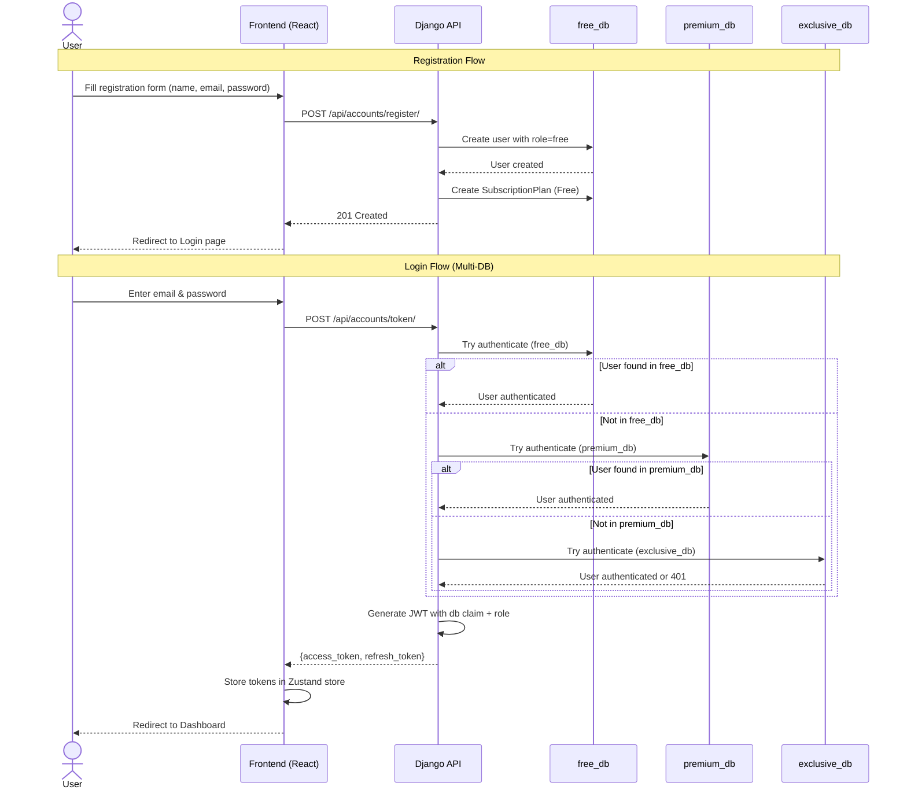

---

## 2. Real-Time Alert Detection Pipeline

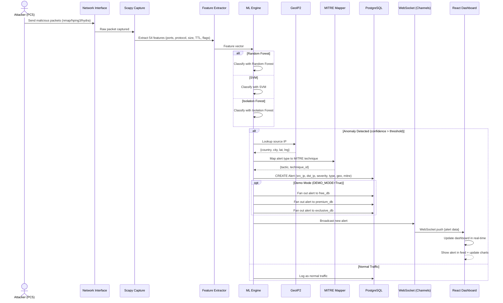

---

## 3. DurianBot Chatbot Interaction (All Tiers)

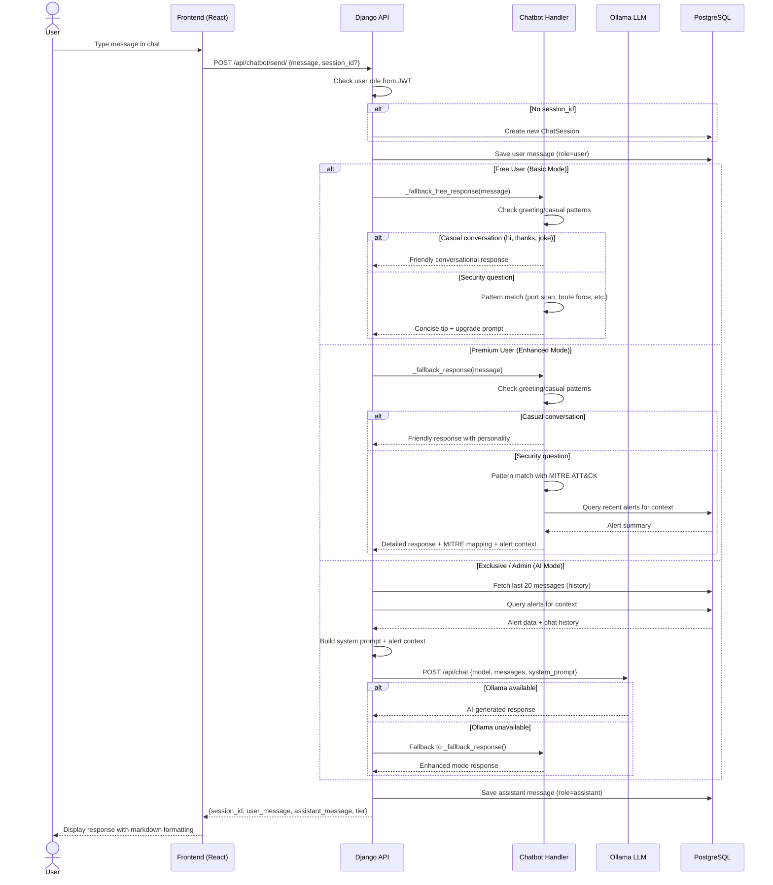

---

## 4. Demo Simulation Flow

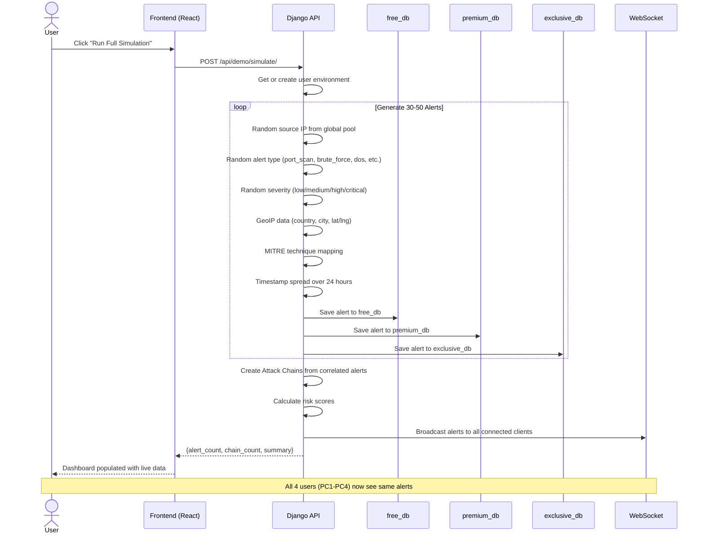

---

## 5. Incident Management Flow

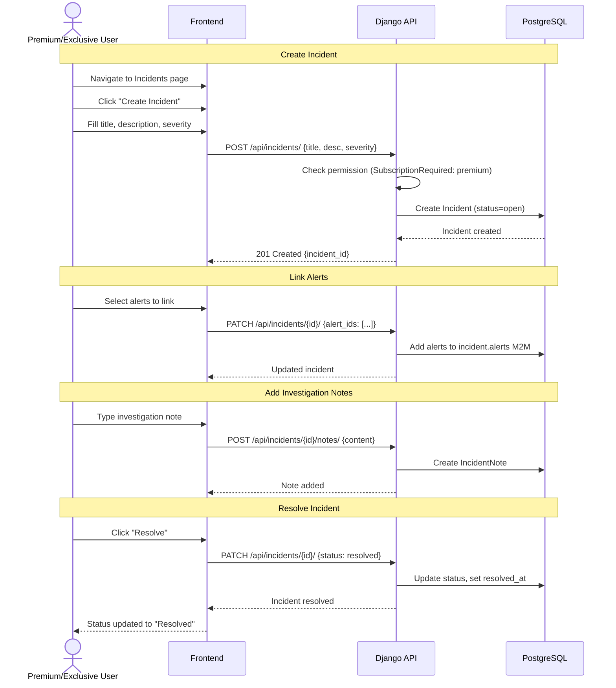

---

## 6. PDF Report Generation

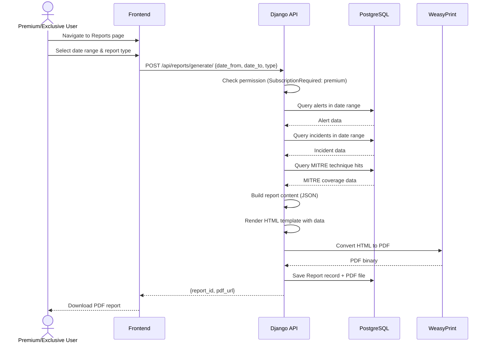

---

## 7. Subscription Upgrade Flow

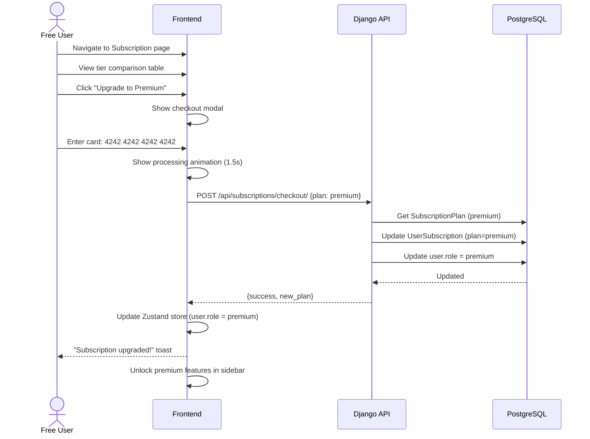

---

## 8. Attack Chain Analysis

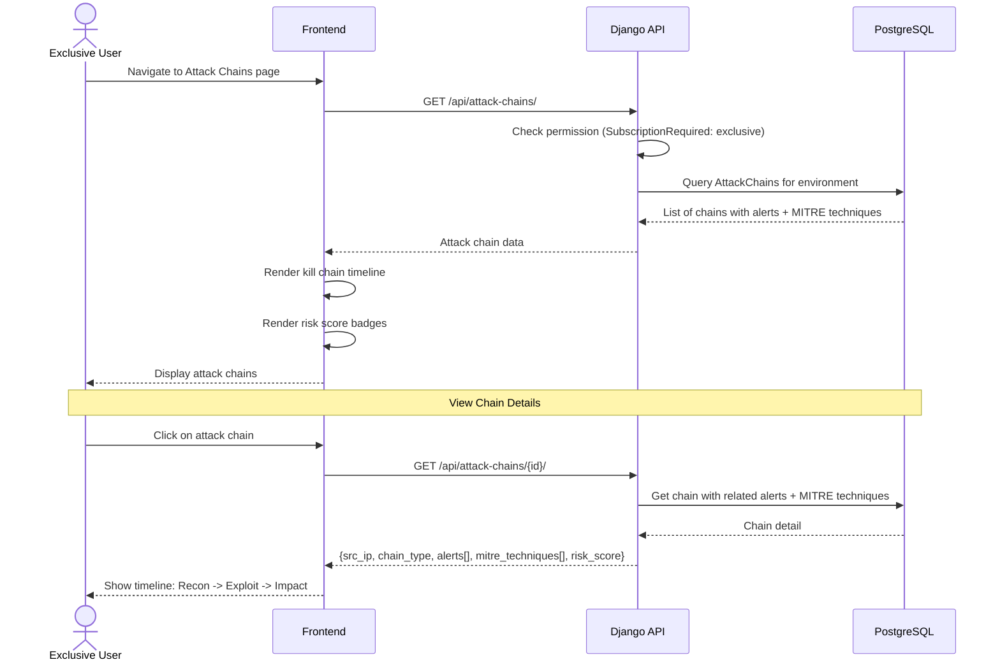

---

## 9. Admin User Management

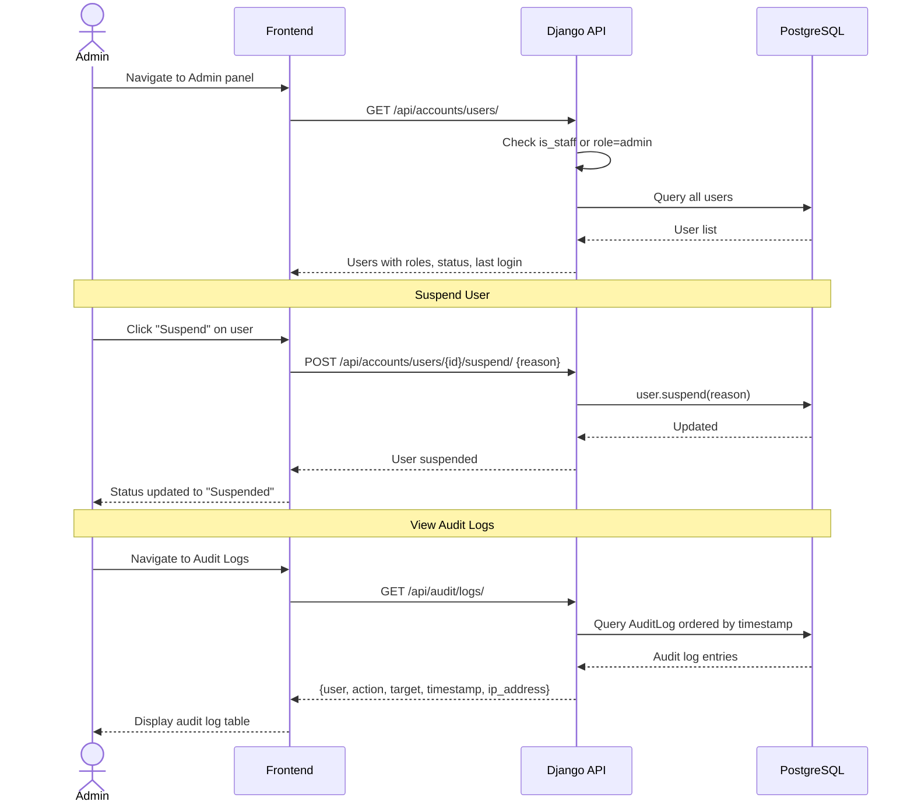

---

## 10. WebSocket Real-Time Alert Flow

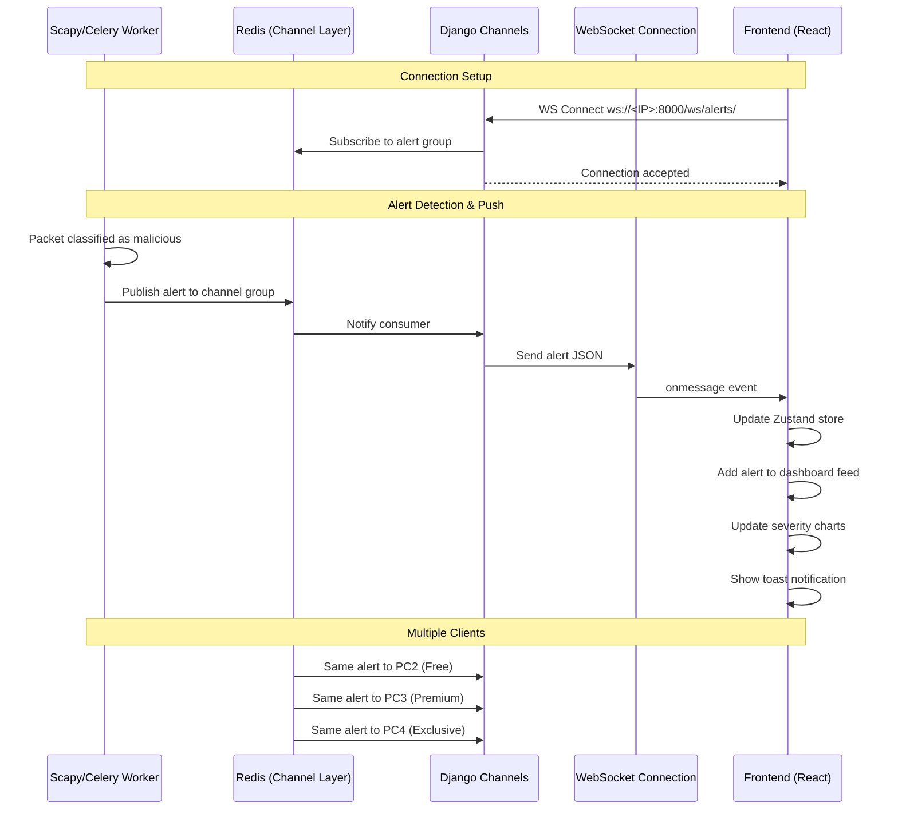

---

## 11. Network Packet Capture & ML Classification

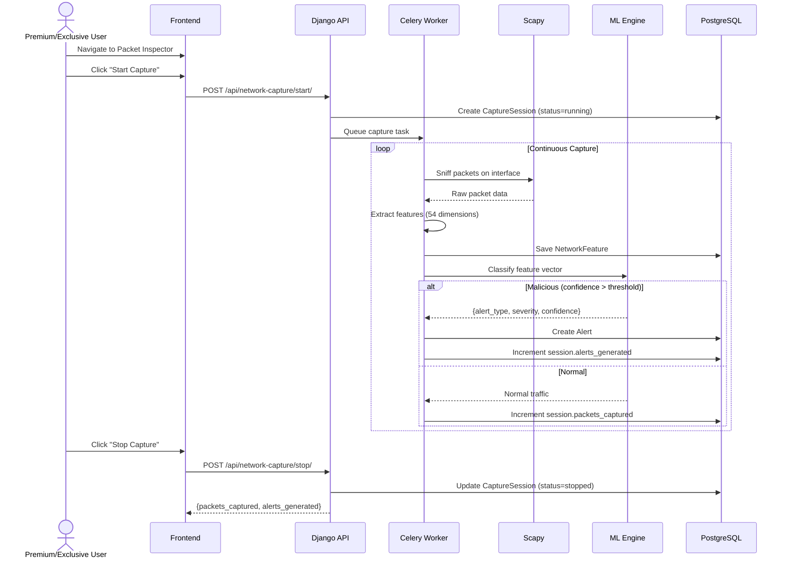

---

## 12. Team Management Flow

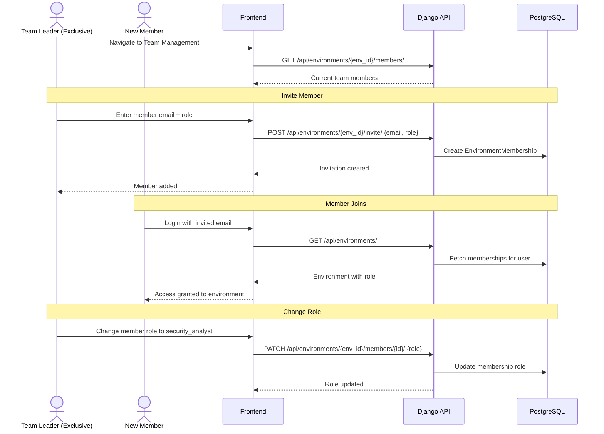
