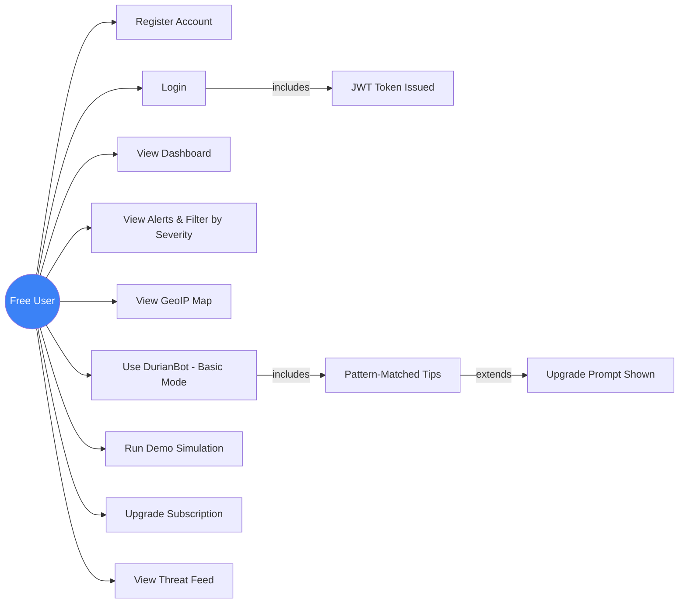
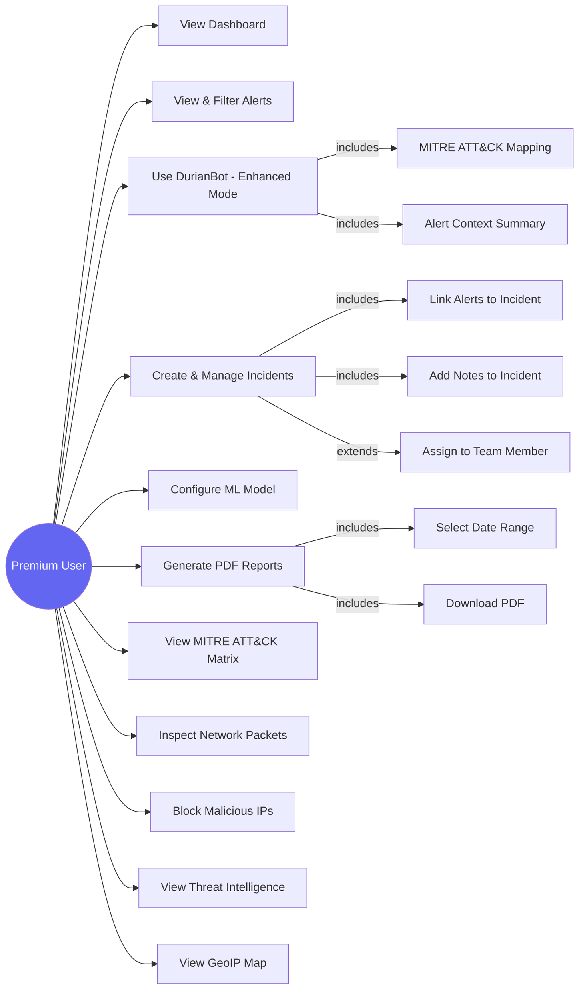
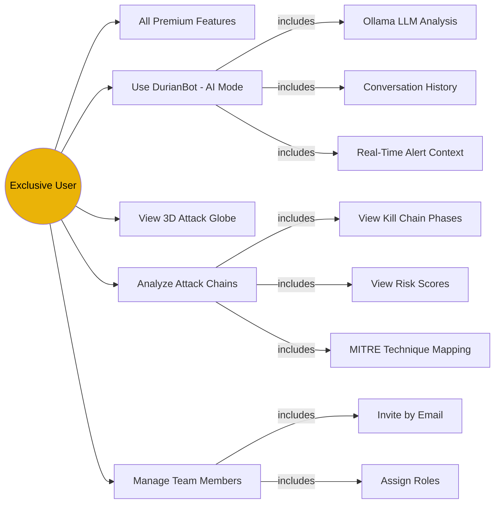
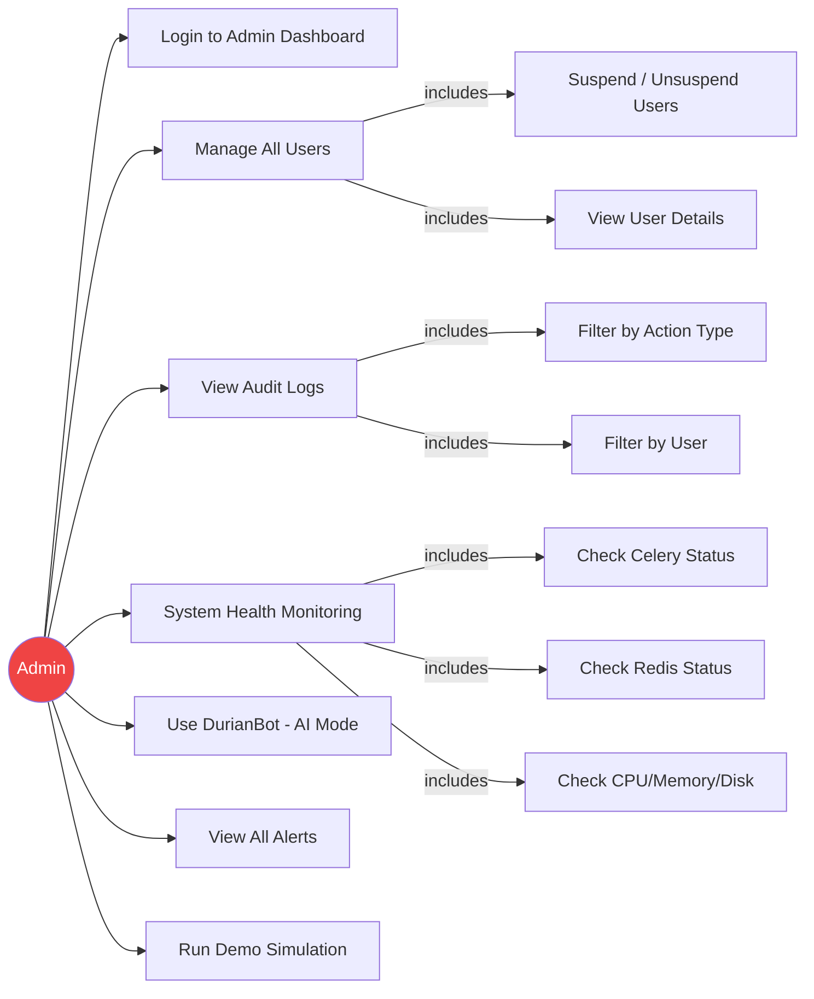
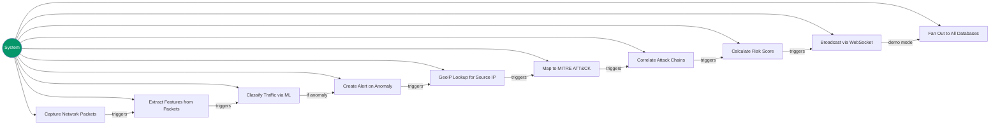

# DurianDetector IDS — Use Case Diagrams
## FYP-26-S1-08

> Paste any of these into [mermaid.live](https://mermaid.live) to render and export as PNG/SVG for your report.

---

## 1. Overall System Use Case Diagram

```mermaid
flowchart TD
    subgraph Actors
        FU["Free User"]
        PU["Premium User"]
        EU["Exclusive User"]
        AD["Admin"]
        ATK["Attacker (External)"]
        SYS["System (Automated)"]
    end

    subgraph DurianDetector["DurianDetector IDS"]
        UC1["Register Account"]
        UC2["Login / JWT Auth"]
        UC3["View Dashboard"]
        UC4["View Alerts"]
        UC5["View GeoIP Map"]
        UC6["Use DurianBot Chatbot"]
        UC7["Run Demo Simulation"]
        UC8["Manage Incidents"]
        UC9["Configure ML Model"]
        UC10["Generate PDF Reports"]
        UC11["View MITRE ATT&CK Matrix"]
        UC12["Inspect Packets"]
        UC13["View 3D Attack Globe"]
        UC14["Analyze Attack Chains"]
        UC15["Manage Team"]
        UC16["DurianBot AI Mode"]
        UC17["Manage Users"]
        UC18["View Audit Logs"]
        UC19["System Health Check"]
        UC20["Block Malicious IP"]
        UC21["View Threat Intelligence"]
        UC22["Manage Subscription"]
        UC23["Capture Network Packets"]
        UC24["Detect Attacks via ML"]
        UC25["Broadcast Real-Time Alerts"]
        UC26["Fan Out Alerts to All DBs"]
        UC27["Generate Attack"]
    end

    %% Free User
    FU --> UC1
    FU --> UC2
    FU --> UC3
    FU --> UC4
    FU --> UC5
    FU --> UC6
    FU --> UC7
    FU --> UC22

    %% Premium User (inherits Free)
    PU --> UC2
    PU --> UC3
    PU --> UC4
    PU --> UC5
    PU --> UC6
    PU --> UC7
    PU --> UC8
    PU --> UC9
    PU --> UC10
    PU --> UC11
    PU --> UC12
    PU --> UC20
    PU --> UC21

    %% Exclusive User (inherits Premium)
    EU --> UC2
    EU --> UC3
    EU --> UC4
    EU --> UC5
    EU --> UC7
    EU --> UC8
    EU --> UC9
    EU --> UC10
    EU --> UC11
    EU --> UC12
    EU --> UC13
    EU --> UC14
    EU --> UC15
    EU --> UC16
    EU --> UC20
    EU --> UC21

    %% Admin
    AD --> UC2
    AD --> UC3
    AD --> UC4
    AD --> UC17
    AD --> UC18
    AD --> UC19
    AD --> UC16

    %% Attacker
    ATK --> UC27

    %% System
    SYS --> UC23
    SYS --> UC24
    SYS --> UC25
    SYS --> UC26

    style FU fill:#3b82f6,color:#fff
    style PU fill:#6366f1,color:#fff
    style EU fill:#eab308,color:#000
    style AD fill:#ef4444,color:#fff
    style ATK fill:#991b1b,color:#fff
    style SYS fill:#059669,color:#fff
```

---

## 2. Free User Use Cases

---

## 3. Premium User Use Cases

---

## 4. Exclusive User Use Cases

---

## 5. Admin Use Cases

---

## 6. System (Automated) Use Cases

