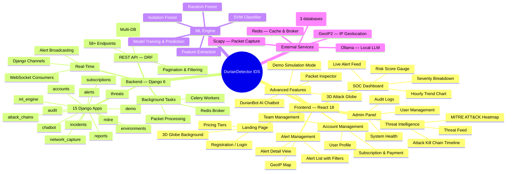
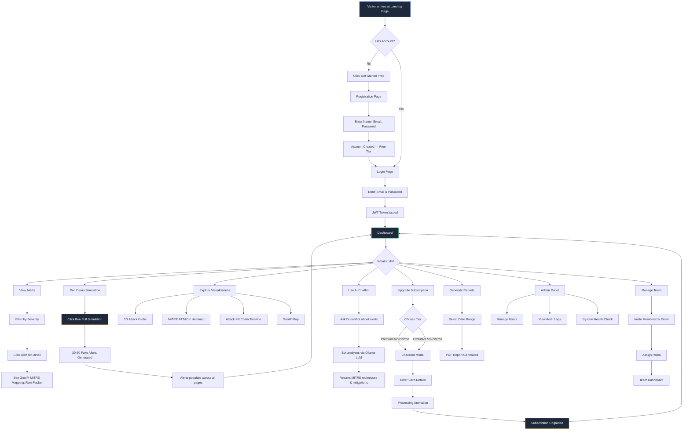
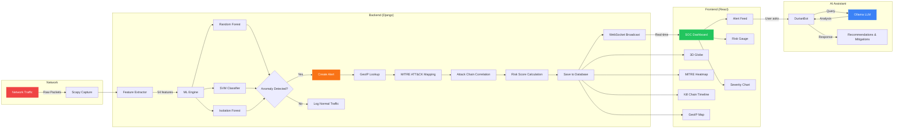
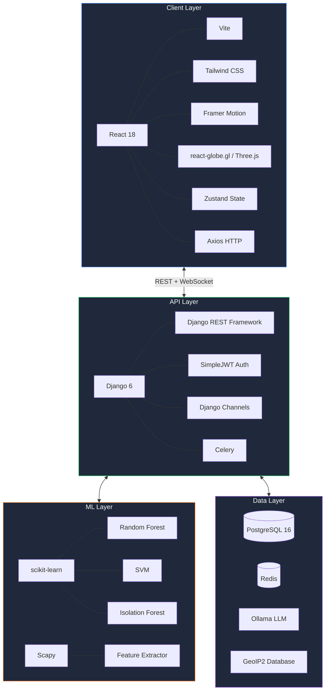
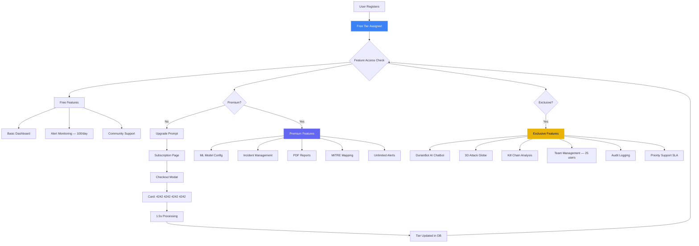
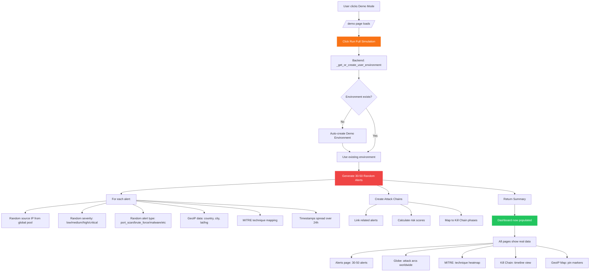
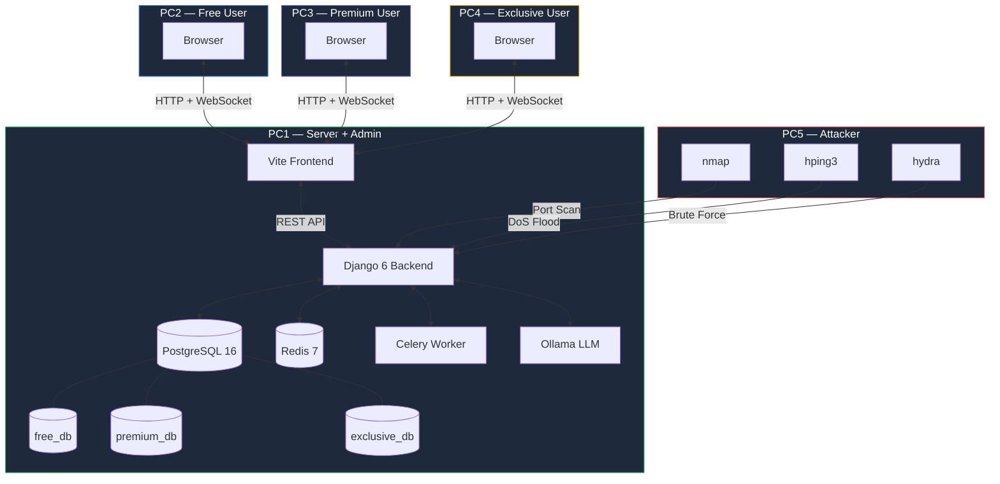
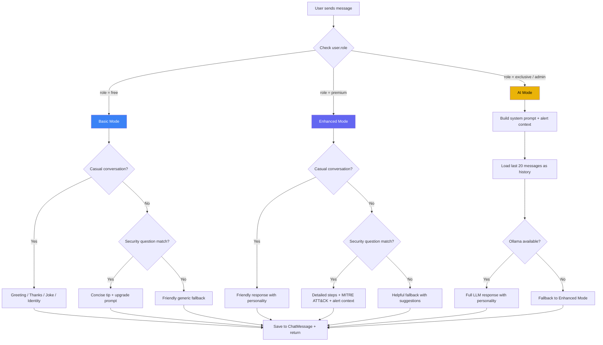

# DurianDetector IDS — Workflow Diagrams
## FYP-26-S1-08

> Paste any of these into [mermaid.live](https://mermaid.live) or import into draw.io (Extras > Mermaid)

---

## 1. System Architecture (Mind Map)

---

## 2. User Journey Workflow

---

## 3. Attack Detection Data Flow

---

## 4. Technology Stack

---

## 5. Subscription & Access Control Flow

---

## 6. Demo Simulation Flow

---

## 7. 5-Computer Live Demo Architecture

---

## 8. DurianBot Chatbot Tier Flow

---

## How to Use These Diagrams

1. **Mermaid Live Editor**: Go to [mermaid.live](https://mermaid.live), paste any code block
2. **Draw.io**: Open draw.io > Extras > Edit Diagram > paste Mermaid code
3. **GitHub**: These render automatically in `.md` files on GitHub
4. **VS Code**: Install "Mermaid Markdown Syntax" extension for preview
5. **Export**: Use mermaid.live to export as PNG/SVG for your FYP report
